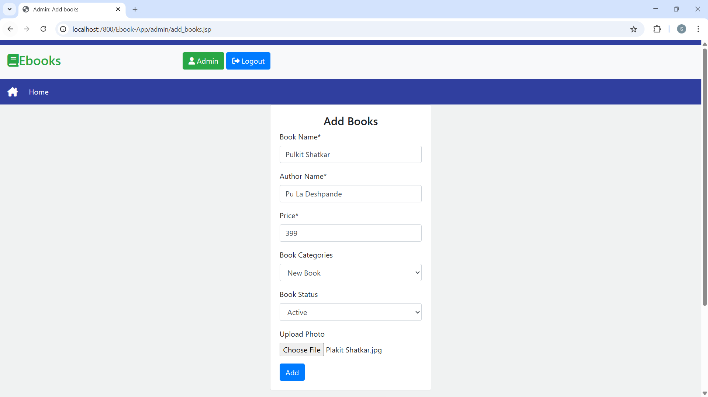

# Pu-La-Library
A digital system to manage books, members, and transactions efficiently.  Enables issuing and searching books. Simplifies library operations and improves member experience.

### Home

### Login

### Register

### Recent Books

### New Books

### Old Books

### Search

### Cart

### Sell Book

### User Profile

### User Settings

### User Sold Books

### Admin – Add Books

### Admin – View Books

### Contact

### Helpline
