# Pu-La-Library
A digital system to manage books, members, and transactions efficiently.  Enables issuing and searching books. Simplifies library operations and improves member experience.

### Register
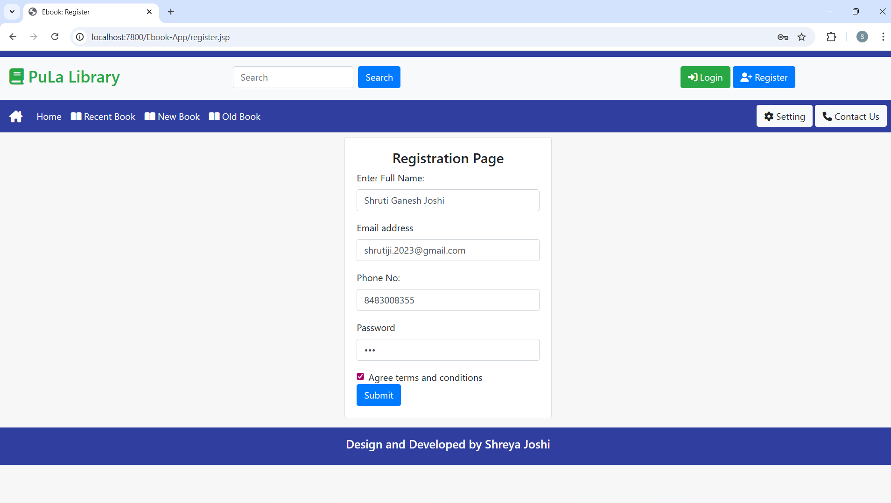

### Login
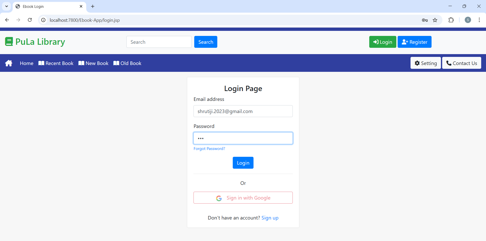

### Home
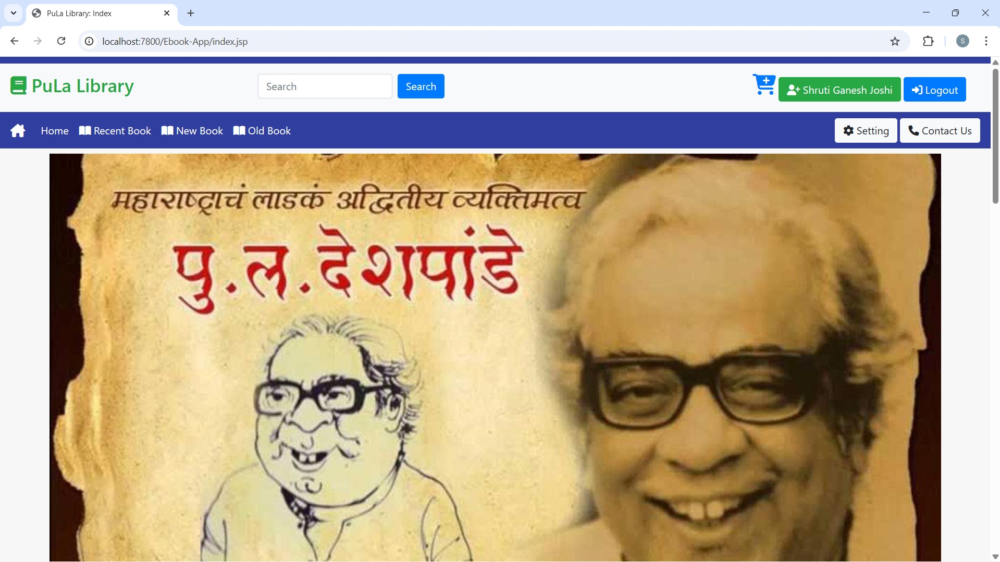

### Recent Books
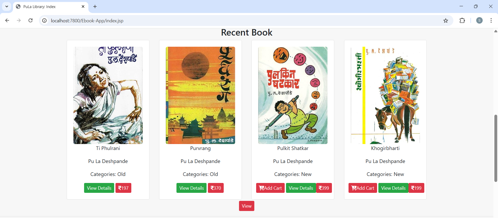

### New Books
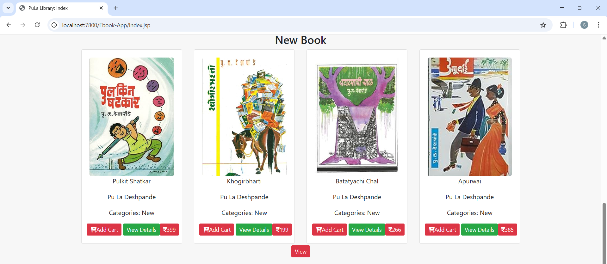

### Old Books
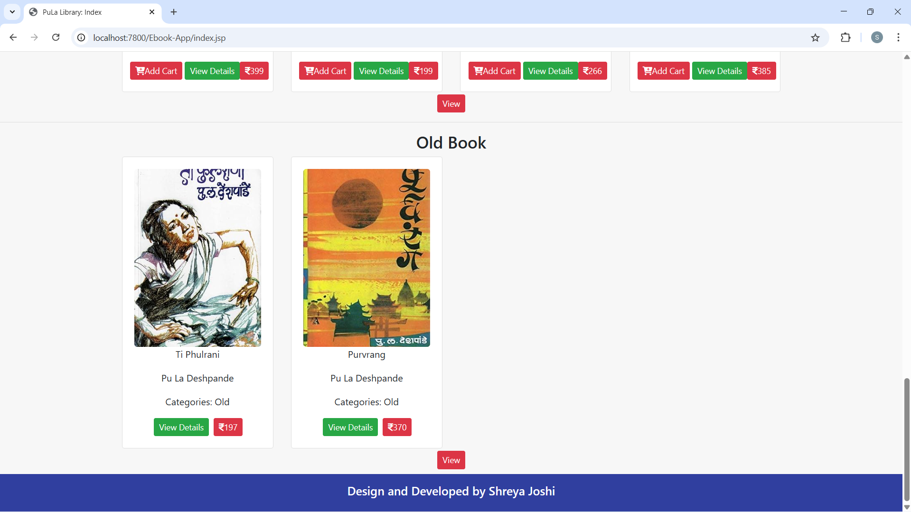

### Search

### Cart
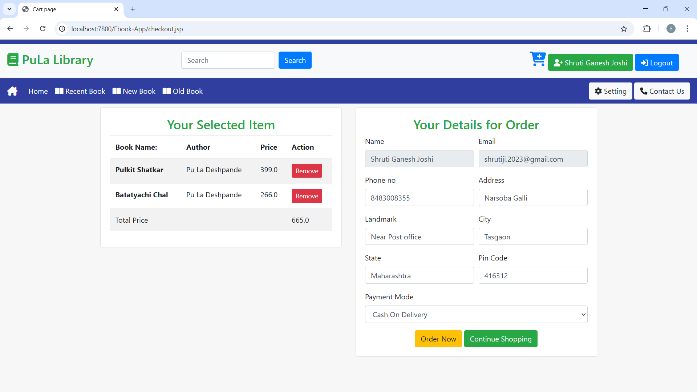

### Sell Book
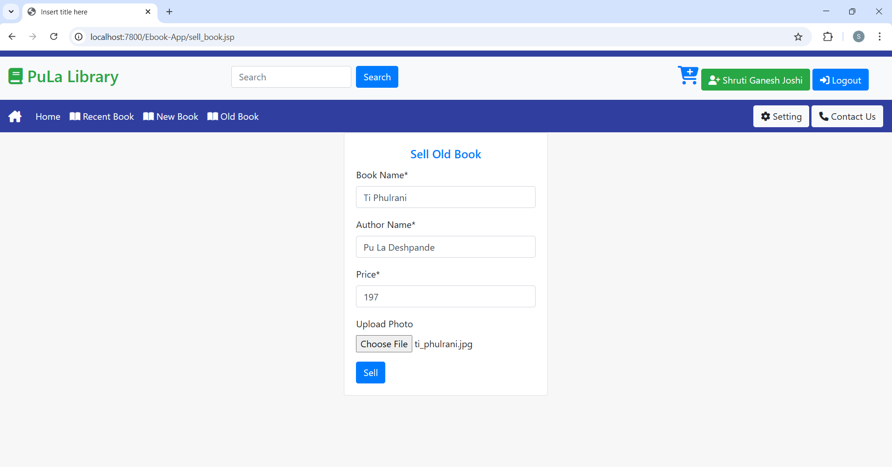

### User Profile
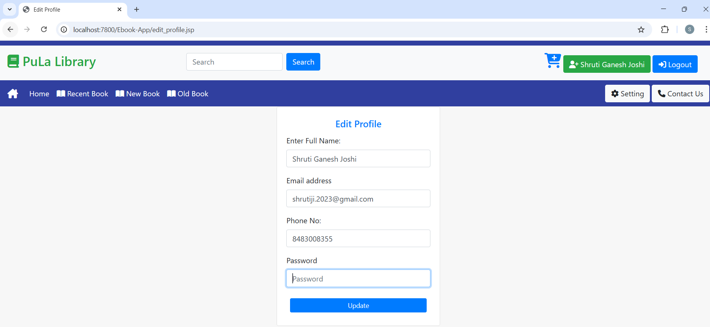

### User Settings
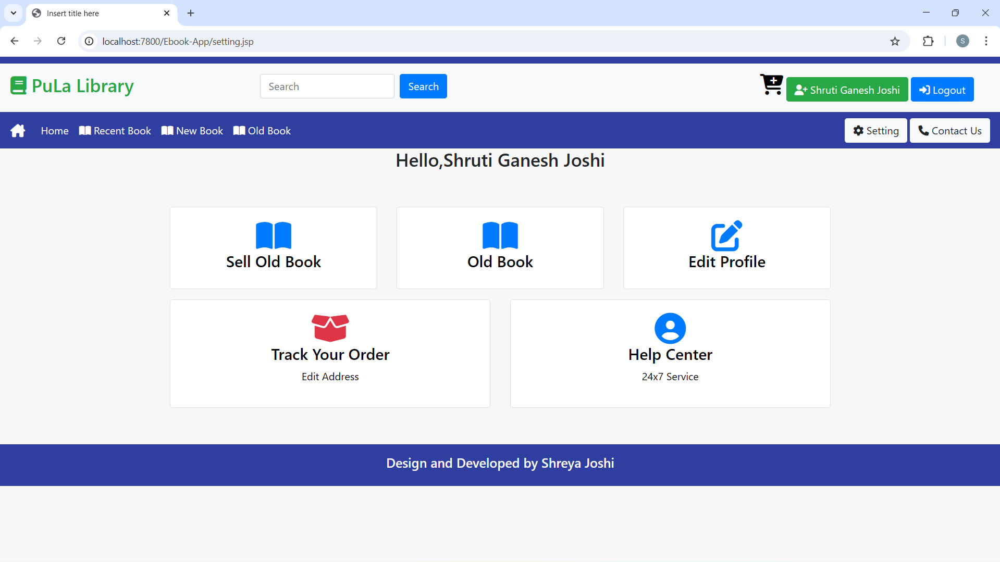

### User Sold Books
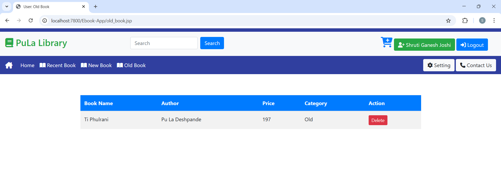

### Admin Login
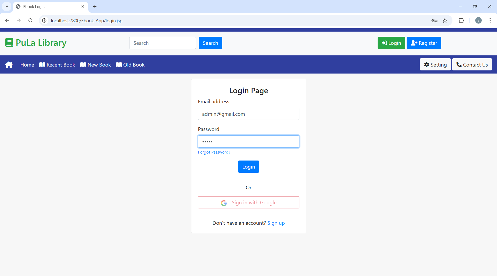

### Admin Dashboard
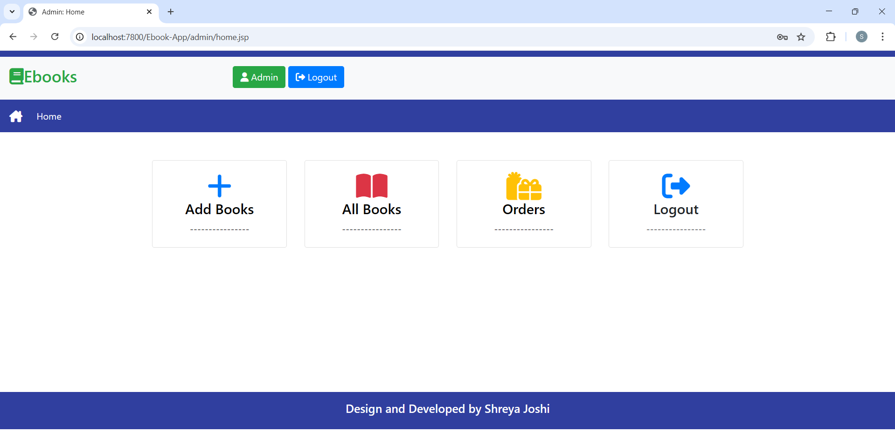

### Admin – View Books
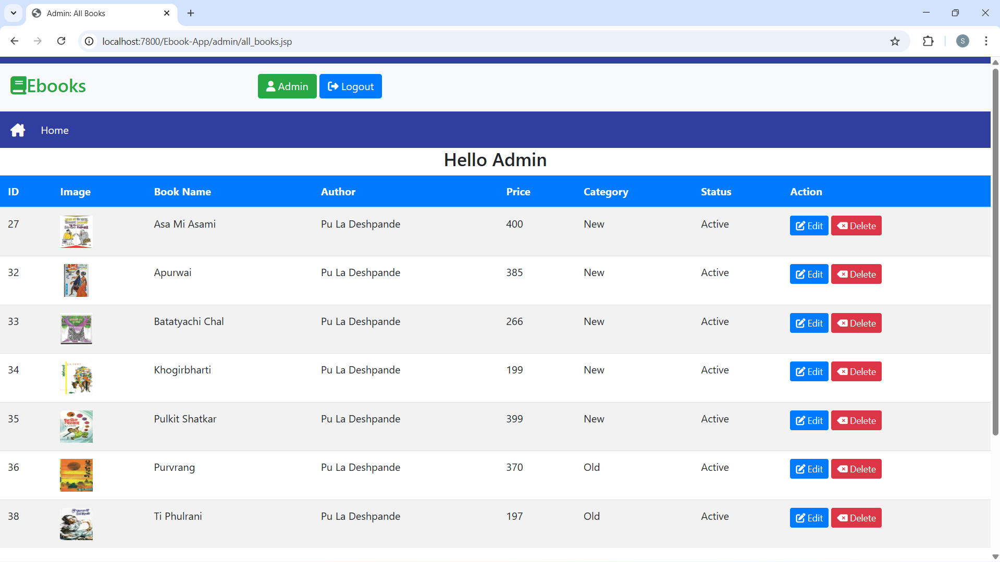

### Contact
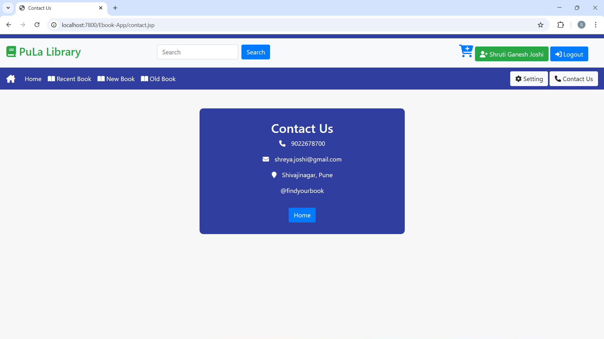

### Helpline
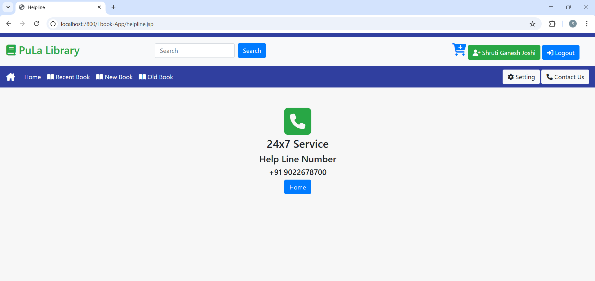
